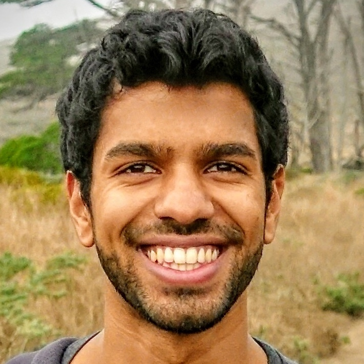

# installation / setup from scratch

- run `source activate python3`
- `pip install tensorflow-gpu==1.14.0`
- start the lab running in the background: `screen jupyter lab --certfile=~/ssl/mycert.pem --keyfile ~/ssl/mykey.key`

# data

## processed data
- `df.csv` in `data_processed/celeba-hq` contains labels along with different metrics for each image

## rerunning pipeline: download all files available in [this gdrive folder](https://drive.google.com/drive/folders/1YO_GZ48o30jTnME-z7d8LlcZoJejcNsk?usp=sharing)
- requires downloading the celeba-hq dataset at 1024 x 1024 resolution (zip file)
    - images should be place at data/celeba-hq/ims
    - annotations are provided in the data/celeba-hq/Anno folder
- different distances can be downloaded as `.npy` files (30k x 30k matrices)
    - `dists_pairwise_facial.npy` - pairwise distances measure by dlib face-rec encodings
    - `dists_pairwise_vgg.npy` - pairwise distances measure by vgg16 perceptual distance (only first 4 layers)

## distances
- analysis here requires the pairwise distance between all 30k images of 3 types: gan dist, facial-rec dist, vgg dist
    - we have calculated each of these matrices store in the gdrive folder
    - they should be placed in the data_processed/ folder

# projection / manipulation
- put image into a directory (e.g. projection_manipulation/test)
- run ./project_new and you will manipulate the altered image along a few attributes:

    

    
    
# matching / benchmarking
- [matching_benchmarking](matching_benchmarking) folder contains code for reproducing the matching and benchmarking results obtained here
    
# disentangling latent space
- experiments to disentangle the latent space of stylegan2
- annotations are available (Z.npy, W.npy) from gdrive folder (place them in the data/annotation-dataest-stylegan2 folder)

# reference
