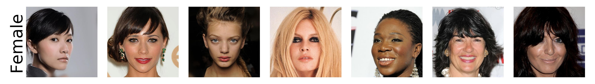
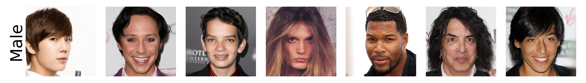
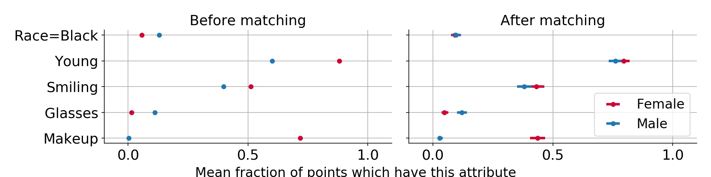

<h1 align="center">Matching in GAN-Space</h1>

Code for using GANs to aid in matching, accompanying the paper "Causal matching with GANS" [arXiv]().

  <a href="#projection-and-manipulation">Projection and manipulation</a> •
  <a href="#matching-and-benchmarking">Matching and benchmarking</a>
   
  <a href="#reproducibility">Reproducibility</a> •
  <a href="#reference">Reference</a> 
   
  Demo: 

# Projection and manipulation
This code allows one to project images into the GAN latent space, after which they can be modified for certain attributes (e.g. age, gender, hair-length) and mixed with other faces (e.g. other people, older/younger versions of the same person). All this code is handled by the `projection_manipulation/project_and_manipulate.sh` script - the easiest way to get started is to use the [Colab notebook](https://colab.research.google.com/drive/1bmYOtuP233cA_zSbcXwkp1yIkvZ1kAPw), where you can upload your own images, and they will be automatically cropped, aligned projected, manipulated, and interpolated

Start with 2 real images (higher-res photos work better, as well as photos where the face is front-facing and not obstructed by things like hats, scarves, etc.):

    
    

Interpolating between the images:

    

Manipulating an image along pre-specified attributes:

    

Can do a lot more, like blending together many faces or interpolating between different faces of the same person!
    
    
# Matching and benchmarking
The matching code [here](matching_benchmarking) finds images that match across a certain attribute (e.g. gender). This is useful for removing confounding factors when doing downstream analyses of things like bias in facial recognition. Similarly, we can perform matching using other methods, such as propensity scores, using the GAN latent space as covariates.

Some example matches:

    
    

After performing matching, confounding is much lower on CelebA-HQ:

    

   

# Reproducibility

## Dependencies
- tested with python 3.6 and tensorflow-gpu 1.14.0
- running the code here requires installing the dependencies for [StyleGAN2](https://github.com/NVlabs/stylegan2)
    - on AWS, this can be done by selecting a deep learning AMI, running `source activate python3`, and then running `pip install tensorflow-gpu==1.14.0`

## Reproducing the entire pipeline may require downloading some (or all) of the files in [this gdrive folder](https://drive.google.com/drive/folders/1YO_GZ48o30jTnME-z7d8LlcZoJejcNsk?usp=sharing)

- `data/celeba-hq/ims` folder
  - unzip the images in  celeba-hq dataset at 1024 x 1024 resolution into this folder
- `data/processed` folder
  - distances: `dists_pairwise_gan.npy`, `dists_pairwise_vgg.npy`, `dists_pairwise_facial.npy`, `dists_pairwise_facial_facenet.npy`, `dists_pairwise_facial_facenet_casia.npy`, `dists_pairwise_facial_vgg2.npy` - (30k x 30k) matrices storing the pairwise distances between all the images in celeba-hq using different distance measures
  - already present in the data folder are annotations (e.g. gender, smiling, eyeglasses) + predicted metrics (e.g. predicted yaw, roll, pitch, quality, race) for each image + latent directions corresponding to different attributes for StyleGAN2
- `gen_latents` - these are used in downstream analysis and are required for the propensity score analysis
- (optional) can download the raw annotations and annotated images as well
- (optional) all these paths can be changed in the `config.py` file

# Reference
- this project builds on many wonderful open-source projects (see the readmes in the [lib](lib) subfolders for more details) including
- [stylegan2](https://github.com/NVlabs/stylegan2) and [stylegan2 encoder](https://github.com/rolux/stylegan2encoder)
- facial recogntion: [dlib](https://github.com/davisking/dlib), python [face_recognition](https://face-recognition.readthedocs.io/en/latest/face_recognition.html), [facenet](https://github.com/davidsandberg/facenet)
- [fairface](https://github.com/joojs/fairface)
- [deep_head_pose](https://github.com/shahroudy/deep-head-pose), [face_segmentation](https://github.com/nasir6/face-segmentation), and [faceQnet](https://github.com/uam-biometrics/FaceQnet)

